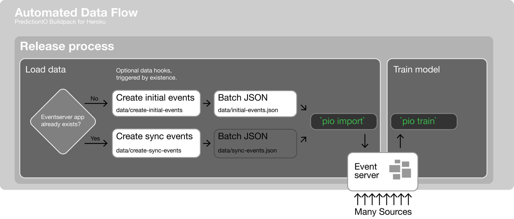

# Data Flow

Training a PredictionIO engine requires data. The right data. Where does this data come from? Where is it stored? And how do we keep it up to date? PredictionIO provides event storage, the eventserver, to collect data and provide a common schema for engines to work with that data.

## Engine integration

Mandatory [environment variables](CUSTOM.md#user-content-environment-variables) must be set before deployment. These are used to create the eventserver app when the engine is first deployed, and then access it throughout the lifecycle of the engine:

* `PIO_EVENTSERVER_APP_NAME`: name for the dataset
* `PIO_EVENTSERVER_ACCESS_KEY`: a unique, random secret

## Data Hooks

The Heroku buildpack provides optional hooks to automate loading data into event storage during [release phase](https://devcenter.heroku.com/articles/release-phase), when an engine is first deployed and then as the engine is updated over time. Activate a hook by committing the associated named file in `data/`.



The `data/create_x_events` may be any kind of executable, shell scripts (`#!/bin/bash`) being our favorite for their directness & ubiquity. Just make sure they are executable before committing:

```bash
chmod +x data/create_*_events
```

The `pio import` CLI tool leverages Spark to import the events data into the database in parallel from the [batch import](https://predictionio.incubator.apache.org/datacollection/batchimport) JSON format, one object per line. So the `create_x_events` scripts should write out this file format. For example:

```json
{"event":"$set", "entityType":"user", "entityId":"1", "properties":{}, "eventTime":"2017-04-14T18:12:20Z"}
{"event":"$set", "entityType":"user", "entityId":"2", "properties":{}, "eventTime":"2017-04-14T18:12:20Z"}
{"event":"$set", "entityType":"user", "entityId":"3", "properties":{}, "eventTime":"2017-04-14T18:12:20Z"}
{"event":"$set", "entityType":"user", "entityId":"4", "properties":{}, "eventTime":"2017-04-14T18:12:20Z"}
{"event":"$set", "entityType":"user", "entityId":"5", "properties":{}, "eventTime":"2017-04-14T18:12:20Z"}
```

### Initial Events JSON

`data/initial-events.json` \([batch import](https://predictionio.incubator.apache.org/datacollection/batchimport), object-per-line JSON file\)

**Automatically load a small, static set of data for engine demos and example deployments.**

Only loaded if the eventserver does not yet have an app name equal to the `PIO_EVENTSERVER_APP_NAME` environment variable. Once the eventserver has an app defined for the name, this hook will be skipped.

When this file exists, it will be automatically loaded into the eventserver by the buildpack using the `pio import` CLI tool.

### Create Initial Events script

`data/create-initial-events` \(executable e.g. shell script\)

**Automatically select, transform, & load data from external data sources.**

Only invoked if the eventserver does not yet have an app name equal to the `PIO_EVENTSERVER_APP_NAME` environment variable. Once the eventserver has an app defined for the name, this hook will be skipped.

When this file exists, it will be invoked immediately after `pio app new` creates the engine's data store in the eventserver and before `pio train`.

Should output the [batch import](https://predictionio.incubator.apache.org/datacollection/batchimport/) file `data/initial-events.json` which is detected and then loaded using `pio import`. This script may overwrite or append to `data/initial-events.json`, if it already exists.

### Create Sync Events script

`data/create-sync-events` \(executable e.g. shell script\)

**Automatically select, transform, & load *new or updated* data from external data sources.**

Invoked on subsequent releases, when the eventserver already has an app name equal to the `PIO_EVENTSERVER_APP_NAME` environment variable.

When this file exists, it will be invoked before `pio train`.

Should output the [batch import](https://predictionio.incubator.apache.org/datacollection/batchimport/) file `data/sync-events.json` which is automatically loaded using the `pio import` CLI tool.

🗑 If config var `PIO_PURGE_ON_SYNC=true`, then the existing data will be deleted before the import runs.

This script will probably need to track synchronization state, so that it can query for only the changes since last sync. A simple solution is to save `checkpoint` entities to the eventserver along with the data, and recall them before each synchronization by querying the eventserver's REST API. These `checkpoint` entities would have a stable ID like `sync` to save progress as an easily recallable event. For example:

```json
{
  "event":"$set",
  "entityType":"checkpoint",
  "entityId":"sync",
  "properties":{
    "lastUpdatedAt":"2017-04-14T18:12:20Z"
  },
  "eventTime":"2017-04-14T18:12:20Z"
}
```

### Manually invoking data hooks

All three of these hooks work with the [batch import](https://predictionio.incubator.apache.org/datacollection/batchimport/) JSON file format. In addition to running automatically during release, they can be executed manually using a one-off dyno. For example, to perform sync:

```bash
heroku run bash --size Performance-M
$ cd pio-engine/
$ ./data/create-sync-events
$ pio app show $PIO_EVENTSERVER_APP_NAME
# grab the ID of the app, replace `X` in next command
$ pio import --appid X --input data/pio-engine/sync-events.json
```

## REST API

PredictionIO includes the **eventserver**: an [HTTP/JSON interface](https://predictionio.incubator.apache.org/datacollection/eventapi/) that allows other systems to push events into the data store. Once an [eventserver is deployed to Heroku](https://github.com/heroku/predictionio-buildpack/blob/master/CUSTOM.md#user-content-eventserver), its web process serves this API.

### Running Eventserver

```
pio eventserver
```

Once you have PredictionIO installed, this is all it takes to run the Eventserver. It's built-in to the `pio` CLI.
